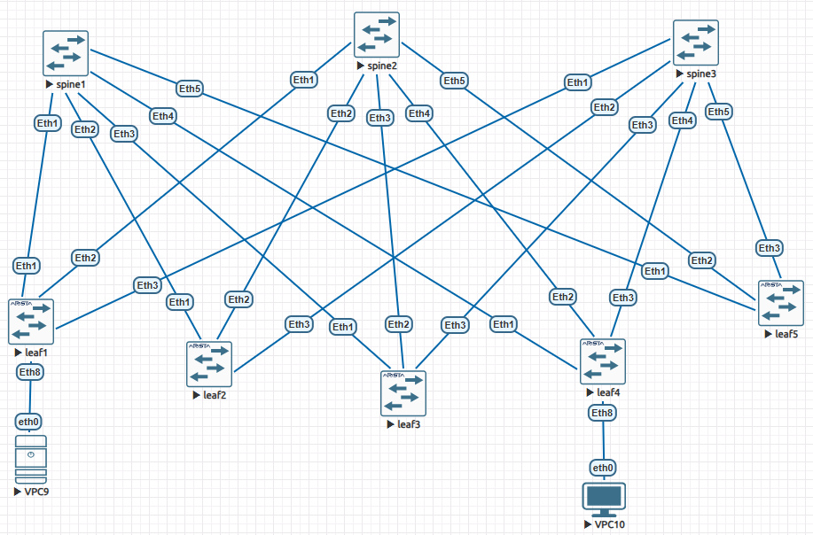

## Underlay. IS-IS

## Цель
Настроить IS-IS для Underlay сети.

## Описание/Пошаговая инструкция выполнения домашнего задания:
1. Настроить ISIS в Underlay сети, для IP связанности между всеми сетевыми устройствами.
2. Зафиксировать в документации - план работы, адресное пространство, схему сети, конфигурацию устройств.
3. Убедиться в наличии IP связанности между устройствами в ISIS домене.

## Топология
Используем топологию и адресное пространство из предыдущего задания:


## Настройка IS-IS
Для запуска IS-IS на каждом устройстве достаточно сделать следующее:
1. Включить маршрутизацию: ```ip routing```
2. Включить ISIS и задать ему имя (пусть будет _N_): ```router isis N```
3. Задать идентификатор в формате _49.area.system_id.00_: ```net 49.0001.0100.7300.1100.00```
4. Указать минимальные настройки для интерфейсов p2p: ```isis enable N```  ```isis network point-to-point```  ```isis circuit-type level-1```
5. Указать минимальные настройки для инетрфейсов loopback: ```isis enable N``` 

## Автоматизация настроек
В скрипт [listswitches.py](listswitches.py) была добавлена обработка конфигурации isis. В файл конфигурации [lab3.yaml](lab3.yaml) помимо настроек ip-адресов были добавлены настройки isis. Все настройки однотипные, ниже пример для leaf2:
```
leaf2:
  ip_routing: yes
  isis: "N"
  isis_address_family: "ipv4 unicast"
  isis_net: "49.0001.0100.7300.0102.00"
  interfaces:
    Lo0:
      ip: 10.73.0.102/32
      description: "leaf2 loopback"
      isis: "N"
    Et1:
      ip: 10.73.1.2/31
      description: "leaf2 to spine1"
      isis: "N"
      isis_network: point-to-point
      isis_circuit-type: level-1
    Et2:
      ip: 10.73.2.2/31
      description: "leaf2 to spine2"
      isis: "N"
      isis_network: point-to-point
      isis_circuit-type: level-1
    Et3:
      ip: 10.73.3.2/31
      description: "leaf2 to spine3"
      isis: "N"
      isis_network: point-to-point
      isis_circuit-type: level-1
```
Демонстрация применения конфига:
```
jst@evelab:~/otus-labs$ lab01/listswitches.py config lab03/lab3.yaml
found telnet ports [32769, 32770, 32771, 32772, 32773, 32774, 32775, 32776]
port 32769 hostname spine1 time 0.305
port 32770 hostname spine2 time 0.286
port 32771 hostname spine3 time 0.288
port 32772 hostname leaf1 time 0.289
port 32773 hostname leaf2 time 0.283
port 32774 hostname leaf3 time 0.289
port 32775 hostname leaf4 time 0.288
port 32776 hostname leaf5 time 0.288
will apply config to node at 32769:
{'ip_routing': True, 'isis': 'N', 'isis_address_family': 'ipv4 unicast', 'isis_net': '49.0001.0100.7300.1100.00', 'interfaces': {'Lo0': {'ip': '10.73.1.100/32', 'description': 'spine1 loopback', 'isis': 'N'}, 'Et1': {'ip': '10.73.1.1/31', 'description': 'spine1 to leaf1', 'isis': 'N', 'isis_network': 'point-to-point', 'isis_circuit-type': 'level-1'}, 'Et2': {'ip': '10.73.1.3/31', 'description': 'spine1 to leaf2', 'isis': 'N', 'isis_network': 'point-to-point', 'isis_circuit-type': 'level-1'}, 'Et3': {'ip': '10.73.1.5/31', 'description': 'spine1 to leaf3', 'isis': 'N', 'isis_network': 'point-to-point', 'isis_circuit-type': 'level-1'}, 'Et4': {'ip': '10.73.1.7/31', 'description': 'spine1 to leaf4', 'isis': 'N', 'isis_network': 'point-to-point', 'isis_circuit-type': 'level-1'}, 'Et5': {'ip': '10.73.1.9/31', 'description': 'spine1 to leaf5', 'isis': 'N', 'isis_network': 'point-to-point', 'isis_circuit-type': 'level-1'}}}

Trying 127.0.0.1...
Connected to 127.0.0.1.
Escape character is '^]'.

spine1(config)#ena
ena
spine1(config)#conf t
conf t
spine1(config)#ip routing
ip routing
spine1(config)#router isis N
router isis N
spine1(config-router-isis)#address-family ipv4 unicast
address-family ipv4 unicast
spine1(config-router-isis-af)#exit
exit
spine1(config-router-isis)#net 49.0001.0100.7300.1100.00
net 49.0001.0100.7300.1100.00
spine1(config-router-isis)#exit
exit
spine1(config)#interface Lo0
interface Lo0
spine1(config-if-Lo0)#no switchport
no switchport
% Incomplete command
spine1(config-if-Lo0)#ip address 10.73.1.100/32
ip address 10.73.1.100/32
spine1(config-if-Lo0)#description spine1 loopback
description spine1 loopback
spine1(config-if-Lo0)#isis enable N
isis enable N
spine1(config-if-Lo0)#exit
exit
spine1(config)#interface Et1
interface Et1
spine1(config-if-Et1)#no switchport
no switchport
spine1(config-if-Et1)#ip address 10.73.1.1/31
ip address 10.73.1.1/31
spine1(config-if-Et1)#description spine1 to leaf1
description spine1 to leaf1
spine1(config-if-Et1)#isis enable N
isis enable N
spine1(config-if-Et1)#isis network point-to-point
isis network point-to-point
spine1(config-if-Et1)#isis circuit-type level-1
isis circuit-type level-1
spine1(config-if-Et1)#exit
exit
spine1(config)#interface Et2
interface Et2
spine1(config-if-Et2)#no switchport
....... и так далее для всех интерфейсов всех устройств .......
```

## Проверка установления соседства и таблицы маршрутизации
В результате применения конфигурации на всех устройствах установилось соседство с подключенными устройствами, заполнились таблицы маршрутизации. 
Пример для leaf2:
```
leaf2#show ip route

VRF: default
Codes: C - connected, S - static, K - kernel,
       O - OSPF, IA - OSPF inter area, E1 - OSPF external type 1,
       E2 - OSPF external type 2, N1 - OSPF NSSA external type 1,
       N2 - OSPF NSSA external type2, B - Other BGP Routes,
       B I - iBGP, B E - eBGP, R - RIP, I L1 - IS-IS level 1,
       I L2 - IS-IS level 2, O3 - OSPFv3, A B - BGP Aggregate,
       A O - OSPF Summary, NG - Nexthop Group Static Route,
       V - VXLAN Control Service, M - Martian,
       DH - DHCP client installed default route,
       DP - Dynamic Policy Route, L - VRF Leaked,
       G  - gRIBI, RC - Route Cache Route

Gateway of last resort is not set

 I L1     10.73.0.101/32 [115/30] via 10.73.1.3, Ethernet1
                                  via 10.73.2.3, Ethernet2
                                  via 10.73.3.3, Ethernet3
 C        10.73.0.102/32 is directly connected, Loopback0
 I L1     10.73.0.103/32 [115/30] via 10.73.1.3, Ethernet1
                                  via 10.73.2.3, Ethernet2
                                  via 10.73.3.3, Ethernet3
 I L1     10.73.0.104/32 [115/30] via 10.73.1.3, Ethernet1
                                  via 10.73.2.3, Ethernet2
                                  via 10.73.3.3, Ethernet3
 I L1     10.73.0.105/32 [115/30] via 10.73.1.3, Ethernet1
                                  via 10.73.2.3, Ethernet2
                                  via 10.73.3.3, Ethernet3
 I L1     10.73.1.0/31 [115/20] via 10.73.1.3, Ethernet1
 C        10.73.1.2/31 is directly connected, Ethernet1
 I L1     10.73.1.4/31 [115/20] via 10.73.1.3, Ethernet1
 I L1     10.73.1.6/31 [115/20] via 10.73.1.3, Ethernet1
 I L1     10.73.1.8/31 [115/20] via 10.73.1.3, Ethernet1
 I L1     10.73.1.100/32 [115/20] via 10.73.1.3, Ethernet1
 I L1     10.73.2.0/31 [115/20] via 10.73.2.3, Ethernet2
 C        10.73.2.2/31 is directly connected, Ethernet2
 I L1     10.73.2.4/31 [115/20] via 10.73.2.3, Ethernet2
 I L1     10.73.2.6/31 [115/20] via 10.73.2.3, Ethernet2
 I L1     10.73.2.8/31 [115/20] via 10.73.2.3, Ethernet2
 I L1     10.73.2.100/32 [115/20] via 10.73.2.3, Ethernet2
 I L1     10.73.3.0/31 [115/20] via 10.73.3.3, Ethernet3
 C        10.73.3.2/31 is directly connected, Ethernet3
 I L1     10.73.3.4/31 [115/20] via 10.73.3.3, Ethernet3
 I L1     10.73.3.6/31 [115/20] via 10.73.3.3, Ethernet3
 I L1     10.73.3.8/31 [115/20] via 10.73.3.3, Ethernet3
 I L1     10.73.3.100/32 [115/20] via 10.73.3.3, Ethernet3

leaf2#show isis database
IS-IS Instance: N VRF: default
  IS-IS Level 1 Link State Database
    LSPID                   Seq Num  Cksum  Life Length IS Flags
    leaf1.00-00                   8  51583   802    145 L2 <>
    leaf2.00-00                   9  13825   810    145 L2 <>
    leaf3.00-00                   8   2079   812    145 L2 <>
    leaf4.00-00                   8  10222   820    145 L2 <>
    leaf5.00-00                   8  38255   821    145 L2 <>
    spine1.00-00                 12  36980   818    194 L2 <>
    spine2.00-00                 13  11449   820    194 L2 <>
    spine3.00-00                 13  48649   821    194 L2 <>
  IS-IS Level 2 Link State Database
    LSPID                   Seq Num  Cksum  Life Length IS Flags
    leaf2.00-00                  14   8634   819    271 L2 <>

leaf2#show isis neigh
Instance  VRF      System Id        Type Interface          SNPA              State Hold time   Circuit Id
N         default  spine1           L1   Ethernet1          P2P               UP    24          0F
N         default  spine2           L1   Ethernet2          P2P               UP    24          0E
N         default  spine3           L1   Ethernet3          P2P               UP    28          0E
leaf2#
```

## Проверка связности
Результат проверки связности при помощи функции test скрипта [listswitches.py](listswitches.py):
| src \ dst | spine1 | spine2 | spine3 | leaf1 | leaf2 | leaf3 | leaf4 | leaf5 |
|-----------|-----------|-----------|-----------|-----------|-----------|-----------|-----------|-----------|
| spine1 | 0.06 ms | 8.97 ms | 9.32 ms | 5.01 ms | 5.44 ms | 4.65 ms | 4.85 ms | 5.94 ms |
| spine2 | 9.31 ms | 0.07 ms | 15.81 ms | 5.01 ms | 4.42 ms | 5.57 ms | 8.09 ms | 4.67 ms |
| spine3 | 10.38 ms | 10.52 ms | 0.05 ms | 4.84 ms | 6.47 ms | 4.67 ms | 4.74 ms | 4.46 ms |
| leaf1 | 5.46 ms | 6.33 ms | 5.53 ms | 0.03 ms | 9.43 ms | 10.02 ms | 10.65 ms | 8.86 ms |
| leaf2 | 4.61 ms | 4.54 ms | 7.87 ms | 9.91 ms | 0.05 ms | 12.40 ms | 12.05 ms | 10.49 ms |
| leaf3 | 4.96 ms | 5.20 ms | 4.79 ms | 9.48 ms | 11.95 ms | 0.06 ms | 9.68 ms | 10.73 ms |
| leaf4 | 4.45 ms | 5.10 ms | 5.14 ms | 11.23 ms | 9.60 ms | 8.89 ms | 0.05 ms | 9.97 ms |
| leaf5 | 4.84 ms | 5.06 ms | 14.17 ms | 15.93 ms | 9.89 ms | 11.13 ms | 16.72 ms | 0.07 ms |

Наблюдения можно сделать те же, что в предыдущем задании по ospf:
1. Минимальное время пинга самого себя.
2. Время прохождения пинга между leaf и spine составляет около 5 мс - маршрут в 1 хоп.
3. Время прохождения пинга между двумя leaf или двумя spine - около 10 мс, что косвенно говорит о маршруте в 2 хопа.
