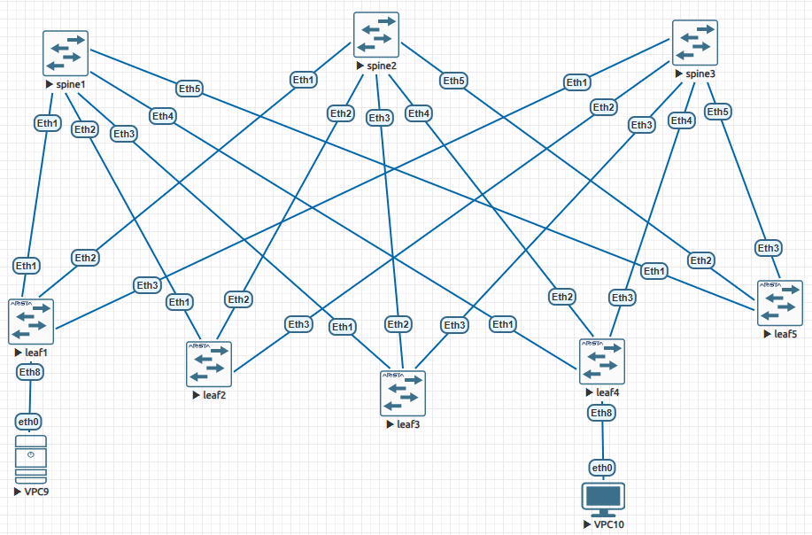

## Underlay. BGP

## Цель
Настроить BGP для Underlay сети.

## Описание/Пошаговая инструкция выполнения домашнего задания:
1. Настроить BGP в Underlay сети, для IP связанности между всеми сетевыми устройствами.
2. Зафиксировать в документации - план работы, адресное пространство, схему сети, конфигурацию устройств.
3. Убедиться в наличии IP связанности между устройствами в BGP домене.

## Топология
Используем топологию и адресное пространство из предыдущего задания:


## Настройка iBGP
Для запуска iBGP на каждом устройстве достаточно сделать следующее:
1. Включить маршрутизацию: ```ip routing```
2. Включить BGP и задать номер AS (пусть будет _65500_): ```router bgp 65500```
3. Указать префиксы, которые будут анонсироваться в BGP (в нашем случае префиск Lo0): ```network 10.73.1.100/32```
4. Задать router-id (в нашем случае адрес Lo0): ```router-id 10.73.1.100```
5. Далее необходимо объявить соседей. Для каждого соседа необходимо указать номер AS: ```neighbor ... remote-as 65500```
6. Так же включим bfd для более быстрого обнаружения отказов: ```neighbor ... bfd```
7. Соседей-лифов со стороны спайнов необходимо объявить как route-reflector-client, чтобы спайны выступали в роли RR: ```neighbor ... route-reflector-client```  ```neighbor ... next-hop-self```
8. Эти настройки удобно задавать через пир-групы, причем все группы могут быть объявлены на всех устройствах, а в конфигах используются только нужные.

## Автоматизация настроек
В скрипт [listswitches.py](listswitches.py) была добавлена обработка конфигурации bgp. В файл конфигурации [ibgp.yaml](ibgp.yaml) помимо настроек ip-адресов были добавлены настройки ibgp, а так же глобальная секция с объявлением пир-групп. Ниже часть файла настроек, объявление пир-групп и по одному leaf и spine:
```
peer_groups:
  LEAVES:
    remote-as: 65500
    bfd: yes
    route-reflector-client: yes
    next-hop-self: yes
  SPINES:
    remote-as: 65500
    bfd: yes

spine1:
  ip_routing: yes
  bgp:
    AS: 65500
    network: 10.73.1.100/32
    router-id: 10.73.1.100
    neighbours:
      leaf1:
        address: 10.73.1.0
        peer_group: LEAVES
      leaf2:
        address: 10.73.1.2
        peer_group: LEAVES
      leaf3:
        address: 10.73.1.4
        peer_group: LEAVES
      leaf4:
        address: 10.73.1.6
        peer_group: LEAVES
      leaf5:
        address: 10.73.1.8
        peer_group: LEAVES
  interfaces:
    Lo0:
      ip: 10.73.1.100/32
      description: "spine1 loopback"
    Et1:
      ip: 10.73.1.1/31
      description: "spine1 to leaf1"
    Et2:
      ip: 10.73.1.3/31
      description: "spine1 to leaf2"
    Et3:
      ip: 10.73.1.5/31
      description: "spine1 to leaf3"
    Et4:
      ip: 10.73.1.7/31
      description: "spine1 to leaf4"
    Et5:
      ip: 10.73.1.9/31
      description: "spine1 to leaf5"
leaf1:
  ip_routing: yes
  bgp:
    AS: 65500
    network: 10.73.0.101/32
    router-id: 10.73.0.101
    neighbours:
      spine1:
        address: 10.73.1.1
        peer_group: SPINES
      spine2:
        address: 10.73.2.1
        peer_group: SPINES
      spine3:
        address: 10.73.3.1
        peer_group: SPINES
  interfaces:
    Lo0:
      ip: 10.73.0.101/32
      description: "leaf1 loopback"
    Et1:
      ip: 10.73.1.0/31
      description: "leaf1 to spine1"
    Et2:
      ip: 10.73.2.0/31
      description: "leaf1 to spine2"
    Et3:
      ip: 10.73.3.0/31
      description: "leaf1 to spine3"
```
Демонстрация применения конфига:
```
jst@evelab:~/otus-labs$ lab01/listswitches.py config lab03/lab3.yaml
found telnet ports [32769, 32770, 32771, 32772, 32773, 32774, 32775, 32776]
port 32769 hostname spine1 time 0.305
port 32770 hostname spine2 time 0.286
port 32771 hostname spine3 time 0.288
port 32772 hostname leaf1 time 0.289
port 32773 hostname leaf2 time 0.283
port 32774 hostname leaf3 time 0.289
port 32775 hostname leaf4 time 0.288
port 32776 hostname leaf5 time 0.288
will apply config to node at 32769:
{'ip_routing': True, 'isis': 'N', 'isis_address_family': 'ipv4 unicast', 'isis_net': '49.0001.0100.7300.1100.00', 'interfaces': {'Lo0': {'ip': '10.73.1.100/32', 'description': 'spine1 loopback', 'isis': 'N'}, 'Et1': {'ip': '10.73.1.1/31', 'description': 'spine1 to leaf1', 'isis': 'N', 'isis_network': 'point-to-point', 'isis_circuit-type': 'level-1'}, 'Et2': {'ip': '10.73.1.3/31', 'description': 'spine1 to leaf2', 'isis': 'N', 'isis_network': 'point-to-point', 'isis_circuit-type': 'level-1'}, 'Et3': {'ip': '10.73.1.5/31', 'description': 'spine1 to leaf3', 'isis': 'N', 'isis_network': 'point-to-point', 'isis_circuit-type': 'level-1'}, 'Et4': {'ip': '10.73.1.7/31', 'description': 'spine1 to leaf4', 'isis': 'N', 'isis_network': 'point-to-point', 'isis_circuit-type': 'level-1'}, 'Et5': {'ip': '10.73.1.9/31', 'description': 'spine1 to leaf5', 'isis': 'N', 'isis_network': 'point-to-point', 'isis_circuit-type': 'level-1'}}}

Trying 127.0.0.1...
Connected to 127.0.0.1.
Escape character is '^]'.

spine1(config)#ena
ena
spine1(config)#conf t
conf t
spine1(config)#ip routing
ip routing
spine1(config)#router isis N
router isis N
spine1(config-router-isis)#address-family ipv4 unicast
address-family ipv4 unicast
spine1(config-router-isis-af)#exit
exit
spine1(config-router-isis)#net 49.0001.0100.7300.1100.00
net 49.0001.0100.7300.1100.00
spine1(config-router-isis)#exit
exit
spine1(config)#interface Lo0
interface Lo0
spine1(config-if-Lo0)#no switchport
no switchport
% Incomplete command
spine1(config-if-Lo0)#ip address 10.73.1.100/32
ip address 10.73.1.100/32
spine1(config-if-Lo0)#description spine1 loopback
description spine1 loopback
spine1(config-if-Lo0)#isis enable N
isis enable N
spine1(config-if-Lo0)#exit
exit
spine1(config)#interface Et1
interface Et1
spine1(config-if-Et1)#no switchport
no switchport
spine1(config-if-Et1)#ip address 10.73.1.1/31
ip address 10.73.1.1/31
spine1(config-if-Et1)#description spine1 to leaf1
description spine1 to leaf1
spine1(config-if-Et1)#isis enable N
isis enable N
spine1(config-if-Et1)#isis network point-to-point
isis network point-to-point
spine1(config-if-Et1)#isis circuit-type level-1
isis circuit-type level-1
spine1(config-if-Et1)#exit
exit
spine1(config)#interface Et2
interface Et2
spine1(config-if-Et2)#no switchport
....... и так далее для всех интерфейсов всех устройств .......
```

## Проверка установления соседства и таблицы маршрутизации
В результате применения конфигурации на всех устройствах установилось соседство с подключенными устройствами, заполнились таблицы маршрутизации. 
Пример для leaf2:
```
leaf2#show ip bgp summary
BGP summary information for VRF default
Router identifier 10.73.0.102, local AS number 65500
Neighbor Status Codes: m - Under maintenance
  Neighbor         V  AS           MsgRcvd   MsgSent  InQ OutQ  Up/Down State   PfxRcd PfxAcc
  10.73.1.3        4  65500            124       108    0    0 00:03:48 Estab   5      5
  10.73.2.3        4  65500            131       109    0    0 00:03:48 Estab   5      5
  10.73.3.3        4  65500            133       102    0    0 00:03:48 Estab   5      5

leaf2#show ip bgp
BGP routing table information for VRF default
Router identifier 10.73.0.102, local AS number 65500
Route status codes: * - valid, > - active, # - not installed, E - ECMP head, e - ECMP
                    S - Stale, c - Contributing to ECMP, b - backup, L - labeled-unicast
Origin codes: i - IGP, e - EGP, ? - incomplete
AS Path Attributes: Or-ID - Originator ID, C-LST - Cluster List, LL Nexthop - Link Local Nexthop

         Network                Next Hop            Metric  LocPref Weight  Path
 * >     10.73.0.101/32         10.73.1.3             0       100     0       i Or-ID: 10.73.0.101 C-LST: 10.73.1.100
 *       10.73.0.101/32         10.73.2.3             0       100     0       i Or-ID: 10.73.0.101 C-LST: 10.73.2.100
 *       10.73.0.101/32         10.73.3.3             0       100     0       i Or-ID: 10.73.0.101 C-LST: 10.73.3.100
 * >     10.73.0.102/32         -                     0       0       -       i
 * >     10.73.0.103/32         10.73.1.3             0       100     0       i Or-ID: 10.73.0.103 C-LST: 10.73.1.100
 *       10.73.0.103/32         10.73.2.3             0       100     0       i Or-ID: 10.73.0.103 C-LST: 10.73.2.100
 *       10.73.0.103/32         10.73.3.3             0       100     0       i Or-ID: 10.73.0.103 C-LST: 10.73.3.100
 * >     10.73.0.104/32         10.73.1.3             0       100     0       i Or-ID: 10.73.0.104 C-LST: 10.73.1.100
 *       10.73.0.104/32         10.73.2.3             0       100     0       i Or-ID: 10.73.0.104 C-LST: 10.73.2.100
 *       10.73.0.104/32         10.73.3.3             0       100     0       i Or-ID: 10.73.0.104 C-LST: 10.73.3.100
 * >     10.73.0.105/32         10.73.1.3             0       100     0       i Or-ID: 10.73.0.105 C-LST: 10.73.1.100
 *       10.73.0.105/32         10.73.2.3             0       100     0       i Or-ID: 10.73.0.105 C-LST: 10.73.2.100
 *       10.73.0.105/32         10.73.3.3             0       100     0       i Or-ID: 10.73.0.105 C-LST: 10.73.3.100
 * >     10.73.1.100/32         10.73.1.3             0       100     0       i
 * >     10.73.2.100/32         10.73.2.3             0       100     0       i
 * >     10.73.3.100/32         10.73.3.3             0       100     0       i

leaf2#show ip route
 B I      10.73.0.101/32 [200/0] via 10.73.1.3, Ethernet1
 C        10.73.0.102/32 is directly connected, Loopback0
 B I      10.73.0.103/32 [200/0] via 10.73.1.3, Ethernet1
 B I      10.73.0.104/32 [200/0] via 10.73.1.3, Ethernet1
 B I      10.73.0.105/32 [200/0] via 10.73.1.3, Ethernet1
 C        10.73.1.2/31 is directly connected, Ethernet1
 B I      10.73.1.100/32 [200/0] via 10.73.1.3, Ethernet1
 C        10.73.2.2/31 is directly connected, Ethernet2
 B I      10.73.2.100/32 [200/0] via 10.73.2.3, Ethernet2
 C        10.73.3.2/31 is directly connected, Ethernet3
 B I      10.73.3.100/32 [200/0] via 10.73.3.3, Ethernet3
```
Пример для Spine 3:
```
spine3#show ip bgp summary
BGP summary information for VRF default
Router identifier 10.73.3.100, local AS number 65500
Neighbor Status Codes: m - Under maintenance
  Neighbor         V  AS           MsgRcvd   MsgSent  InQ OutQ  Up/Down State   PfxRcd PfxAcc
  10.73.3.0        4  65500            111       149    0    0 00:00:03 Active
  10.73.3.2        4  65500            110       149    0    0 00:00:02 Estab   1      1
  10.73.3.4        4  65500            135       174    0    0 00:00:03 Active
  10.73.3.6        4  65500            121       155    0    0 00:00:00 Estab   1      1
  10.73.3.8        4  65500            120       159    0    0 00:00:03 Active

spine3#show ip bgp
BGP routing table information for VRF default
Router identifier 10.73.3.100, local AS number 65500
Route status codes: * - valid, > - active, # - not installed, E - ECMP head, e - ECMP
                    S - Stale, c - Contributing to ECMP, b - backup, L - labeled-unicast
Origin codes: i - IGP, e - EGP, ? - incomplete
AS Path Attributes: Or-ID - Originator ID, C-LST - Cluster List, LL Nexthop - Link Local Nexthop

         Network                Next Hop            Metric  LocPref Weight  Path
 * >     10.73.0.101/32         10.73.3.0             0       100     0       i
 * >     10.73.0.102/32         10.73.3.2             0       100     0       i
 * >     10.73.0.103/32         10.73.3.4             0       100     0       i
 * >     10.73.0.104/32         10.73.3.6             0       100     0       i
 * >     10.73.0.105/32         10.73.3.8             0       100     0       i
 * >     10.73.3.100/32         -                     0       0       -       i

spine3#show ip route
 B I      10.73.0.101/32 [200/0] via 10.73.3.0, Ethernet1
 B I      10.73.0.102/32 [200/0] via 10.73.3.2, Ethernet2
 B I      10.73.0.103/32 [200/0] via 10.73.3.4, Ethernet3
 B I      10.73.0.104/32 [200/0] via 10.73.3.6, Ethernet4
 B I      10.73.0.105/32 [200/0] via 10.73.3.8, Ethernet5
 C        10.73.3.0/31 is directly connected, Ethernet1
 C        10.73.3.2/31 is directly connected, Ethernet2
 C        10.73.3.4/31 is directly connected, Ethernet3
 C        10.73.3.6/31 is directly connected, Ethernet4
 C        10.73.3.8/31 is directly connected, Ethernet5
 C        10.73.3.100/32 is directly connected, Loopback0
```

## Проверка связности
Результат проверки связности при помощи функции test скрипта [listswitches.py](listswitches.py):
| src \ dst | spine1 | spine2 | spine3 | leaf1 | leaf2 | leaf3 | leaf4 | leaf5 |
|-----------|-----------|-----------|-----------|-----------|-----------|-----------|-----------|-----------|
| spine1 | 0.09 ms | FAIL | FAIL | 2.22 ms | 1.96 ms | 1.98 ms | 2.23 ms | 2.03 ms |
| spine2 | FAIL | 0.10 ms | FAIL | 2.13 ms | 2.37 ms | 3.54 ms | 1.64 ms | 1.74 ms |
| spine3 | FAIL | FAIL | 0.09 ms | 1.81 ms | 1.75 ms | 1.83 ms | 1.61 ms | 1.69 ms |
| leaf1 | 1.57 ms | 1.77 ms | 1.80 ms | 0.06 ms | 2.94 ms | 4.03 ms | 3.30 ms | 3.11 ms |
| leaf2 | 1.67 ms | 1.65 ms | 2.11 ms | 3.10 ms | 0.04 ms | 3.67 ms | 3.29 ms | 4.01 ms |
| leaf3 | 1.60 ms | 1.63 ms | 1.47 ms | 4.49 ms | 3.77 ms | 0.04 ms | 3.31 ms | 8.06 ms |
| leaf4 | 1.59 ms | 1.82 ms | 2.13 ms | 3.65 ms | 4.25 ms | 4.07 ms | 0.04 ms | 4.45 ms |
| leaf5 | 1.62 ms | 2.25 ms | 1.60 ms | 9.41 ms | 3.68 ms | 3.35 ms | 3.59 ms | 0.09 ms |

Наблюдения:
1. Минимальное время пинга самого себя.
2. Время прохождения пинга между leaf и spine составляет около 1.5-2 мс - маршрут в 1 хоп.
3. Время прохождения пинга между двумя leaf - около 3-4 мс, что косвенно говорит о маршруте в 2 хопа.
4. Не проходят пинги между spine. Это ожидаемое поведение, потому что маршруты отражаются только RR'ами, а leaf'ы ими не являются.

## Настройка eBGP
Для запуска eBGP на каждом устройстве достаточно сделать следующее:
1. Включить маршрутизацию: ```ip routing```
2. Включить BGP и задать номер AS (пусть будет _65500_ для всех spine и _6550n_ для leaf): ```router bgp 65500```
3. Указать префиксы, которые будут анонсироваться в BGP (в нашем случае префиск Lo0): ```network 10.73.1.100/32```
4. Задать router-id (в нашем случае адрес Lo0): ```router-id 10.73.1.100```
5. Далее необходимо объявить соседей. Для каждого соседа необходимо указать номер AS: ```neighbor ... remote-as 65500```
6. Так же включим bfd для более быстрого обнаружения отказов: ```neighbor ... bfd```
7. Соседей-лифов со стороны спайнов необходимо объявить как route-reflector-client, чтобы спайны выступали в роли RR: ```neighbor ... route-reflector-client```  ```neighbor ... next-hop-self```
8. Эти настройки удобно задавать через пир-групы, причем все группы могут быть объявлены на всех устройствах, а в конфигах используются только нужные.

| src \ dst | spine1 | spine2 | spine3 | leaf1 | leaf2 | leaf3 | leaf4 | leaf5 |
|-----------|-----------|-----------|-----------|-----------|-----------|-----------|-----------|-----------|
| spine1 | 0.08 ms | FAIL | FAIL | 1.96 ms | 1.65 ms | 6.87 ms | 2.17 ms | 13.07 ms |
| spine2 | FAIL | 0.17 ms | FAIL | 25.35 ms | 8.59 ms | 39.63 ms | 2.05 ms | 2.39 ms |
| spine3 | FAIL | FAIL | 0.42 ms | 2.00 ms | 1.92 ms | 17.08 ms | 3.26 ms | 1.93 ms |
| leaf1 | 1.91 ms | 1.77 ms | 1.62 ms | 0.03 ms | FAIL | 69.22 ms | 16.73 ms | 3.54 ms |
| leaf2 | 1.71 ms | 1.60 ms | 8.77 ms | 5.29 ms | 0.44 ms | 39.73 ms | 5.05 ms | 15.72 ms |
| leaf3 | 1.75 ms | 1.55 ms | 1.61 ms | 3.28 ms | 11.87 ms | 0.11 ms | 33.80 ms | 31.66 ms |
| leaf4 | 2.50 ms | 1.70 ms | 1.59 ms | 4.80 ms | 3.68 ms | 7.56 ms | 0.01 ms | 4.20 ms |
| leaf5 | 2.00 ms | 1.72 ms | FAIL | 4.17 ms | 4.70 ms | 4.18 ms | 33.59 ms | 0.03 ms |

| src \ dst | spine1 | spine2 | spine3 | leaf1 | leaf2 | leaf3 | leaf4 | leaf5 |
|-----------|-----------|-----------|-----------|-----------|-----------|-----------|-----------|-----------|
| spine1 | 0.11 ms | FAIL | FAIL | 1.71 ms | 2.39 ms | 1.87 ms | 1.88 ms | 3.70 ms |
| spine2 | FAIL | 0.11 ms | FAIL | FAIL | 2.41 ms | 2.55 ms | 1.75 ms | 14.73 ms |
| spine3 | FAIL | FAIL | 0.56 ms | 34.06 ms | 10.50 ms | 2.13 ms | 2.58 ms | 2.95 ms |
| leaf1 | 1.81 ms | 2.38 ms | 2.70 ms | 0.04 ms | 41.69 ms | 6.61 ms | 51.26 ms | 23.36 ms |
| leaf2 | 5.51 ms | 2.54 ms | 5.22 ms | 5.27 ms | 0.02 ms | 4.06 ms | 25.12 ms | 3.65 ms |
| leaf3 | 2.57 ms | 10.70 ms | 2.69 ms | 18.35 ms | 3.83 ms | 0.12 ms | 3.94 ms | 26.10 ms |
| leaf4 | 9.86 ms | 4.42 ms | 1.80 ms | 64.88 ms | 153.31 ms | 4.13 ms | 0.03 ms | 24.40 ms |
| leaf5 | 2.30 ms | 1.66 ms | 1.92 ms | 10.90 ms | 3.41 ms | 6.34 ms | 3.30 ms | 0.01 ms |
